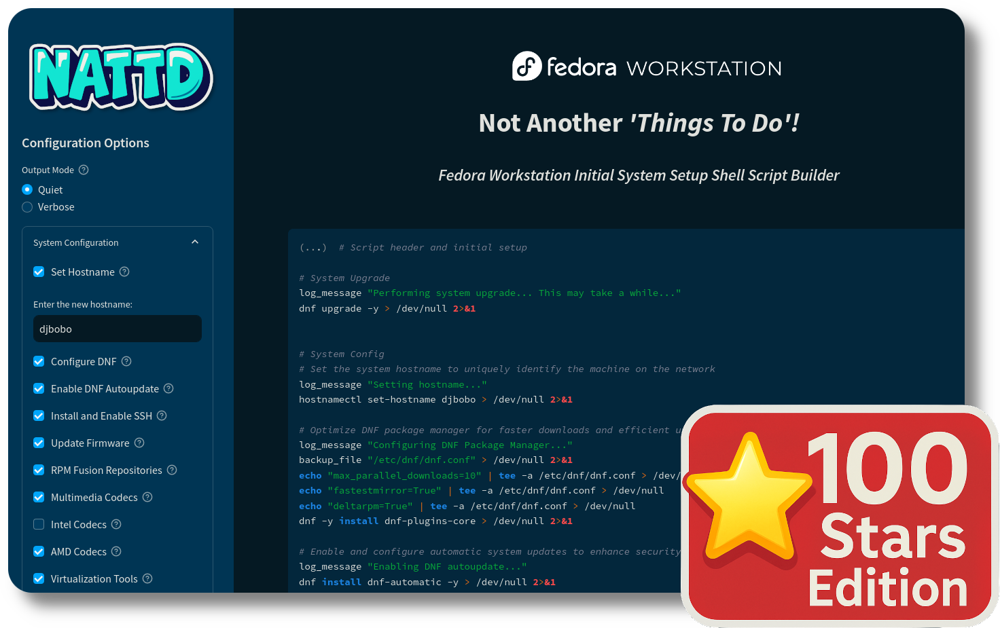

# Fedora Workstation: Not Another 'Things To Do'!



<p align="center">
  <a href="https://nattdf.streamlit.app"></a>
  
  
  
  <a href="https://mktr.sbs/linkedin"></a>
  
</p>

**Initial System Setup Shell Script Builder for Fedora Workstation**

## Overview

This project offers a Streamlit-based web application for generating a tailored shell script to set up a new Fedora Workstation installation. The app provides an intuitive interface for choosing system configurations, applications, and customization options. It is currently open for testing and is generally suitable for production use, although minor bug fixes and code improvements are ongoing.

## Latest Changes
*(As of 2024-09-05)*

We're grateful for the valuable feedback and suggestions from the r/Fedora community. Recent updates include:

- Added a search to the sidebar for easier navigation between available options and applications
- Restructured the Additional Apps section for better organization
- Added a new Coding and DevOps section with tools like Docker, Podman, and VSCodium
- Expanded the list of additional applications, including Pika Backup, Deja Dup, and Tabby Terminal
- Introduced a Bonus Scripts section for standalone customization scripts, including File Templates and NVIDIA Drivers
- Included multimedia, Intel, and AMD codecs from the RPM Fusion repository
- Added virtualization tools for enhanced system capabilities
- Replaced `bpytop` with `btop` for improved system monitoring
- Addressed inconsistent naming conventions across the project for better coherence
- Added more Flatpaks to provide a wider range of application options
- Introduced VSCodium as an open-source alternative to VS Code

Special thanks to [u/RedBearAK](https://www.reddit.com/user/RedBearAK/), [u/ScootSchloingo](https://www.reddit.com/user/ScootSchloingo/), [u/charliesbot](https://www.reddit.com/user/charliesbot/), [u/Laughingatyou1000](https://www.reddit.com/user/Laughingatyou1000/), [u/Papercutter0324](https://www.reddit.com/user/Papercutter0324/), [u/ajunior7](https://www.reddit.com/user/ajunior7/), and [u/intulor](https://www.reddit.com/user/intulor/) for their contributions and insights.

We're continuously working to enhance the script and welcome further suggestions from the community.

## Features

- **System Configuration**: Set hostname, configure DNF, enable auto-updates, install SSH, check for firmware updates, and enable RPM Fusion repositories.
- **Essential Apps**: Install popular command-line tools and utilities with detailed descriptions.
- **Additional Apps**: Choose from a wide range of applications categorized by purpose:
  - Internet & Communication (browsers, email clients, messaging apps)
  - Office & Productivity
  - Coding & DevOps
  - Media & Graphics
  - Gaming & Emulation
  - System Tools
  - Remote Access & Networking
  - File Sharing & Download
- **Customization**: 
  - Install fonts (Windows, Google, Adobe Source)
  - Install themes (e.g., Tela Icon Theme)
  - Configure power settings
  - Set up development environments (Zsh, Oh My Zsh, Miniconda)
- **Advanced Options**: Add custom shell commands to be included in the generated script.
- **Script Preview**: View a preview of the generated script before downloading.
- **One-Click Download**: Generate and download the customized script with a single click.
- **Output Mode Selection**: Choose between Quiet (hide command output) and Verbose (show full output) modes.

## Requirements

- Python 3.7+
- Streamlit
- A modern web browser

## Installation

1. Clone this repository:
   ```
   git clone https://github.com/k-mktr/fedora-things-to-do.git
   cd fedora-things-to-do
   ```

2. Install the required Python packages:
   ```
   pip install streamlit pip --upgrade
   ```

## Usage

1. Run the Streamlit app:
   ```
   streamlit run app.py
   ```

2. Open your web browser and navigate to the URL provided by Streamlit (usually `http://localhost:8501`) or use [our official public instance](https://nattdf.streamlit.app)

3. Use the sidebar to select your desired configuration options.

5. Choose the Output Mode (Quiet or Verbose) to control the level of detail in the generated script.

6. (Optional) Add custom shell commands in the Advanced section.

7. Click the "Build Your Script" button to create your customized script.

8. Review the script preview and click "Download Your Script" to save it.

9. Follow the instructions provided after generating the script to make it executable and run it on your Fedora system.

## Script Template

The `script_template.sh` file serves as the base for the generated script. It includes:

- Error handling and logging functionality
- User prompts for optional steps
- A modular structure that allows for easy customization

## Caution

The generated script will make system-wide changes. Always review the script contents before running it on your system.

## Contributing

Contributions are welcome! If you'd like to see additional apps or options included, please open an issue or submit a pull request. Here are some ways you can contribute:

- Suggest new applications or system configurations to include
- Report bugs or issues you encounter
- Enhance the user interface or add new features

## License

This project is licensed under the GNU General Public License v3.0 - see the [LICENSE](LICENSE) file for details.

## Acknowledgements

- Fedora Project for their excellent Linux distribution
- Streamlit for their intuitive app framework
- All contributors of Open Source Software

## Contact

For questions, feedback, or support, please:
- Open an issue on this repository
- Contact the author: [Karol Stefan Danisz](https://mktr.sbs/linkedin)

## Roadmap

Future plans for this project include:
- ✅ Enhancing user experience with more intuitive interface options
- ✅ Adding Advanced Section for a custom Shell Commands
- Implementing predefined configuration Profiles
- Further organizing the code, improving readability
- Improving the Quiet Mode code logic
- Implementing a feature to save and load custom profiles 
- Developing versions for other Linux distributions (e.g., Debian/Ubuntu)
- Adding more applications and configuration options

## FAQ

### Is this script safe to run on my Fedora system?

The script is designed to be safe, but as with any system-wide changes, it's important to review the script contents before running it. We provide a preview feature so you can see exactly what the script will do. Always ensure you understand the changes that will be made to your system.

### Can I use this script on other Linux distributions?

Currently, this script is specifically designed for Fedora Workstation. While some commands might work on other distributions, we don't recommend using it on non-Fedora systems without significant modifications. We're considering developing versions for other distributions in the future.

### How often is the application list updated?

We strive to keep the application list up-to-date with the latest stable versions available for Fedora. However, the exact update frequency may vary. If you notice an outdated application or would like to suggest a new one, please open an issue on our GitHub repository.

### Can I modify the script after it's generated?

Absolutely! The generated script is just a starting point. You're free to modify it to better suit your needs. Just be careful to maintain proper syntax and consider the potential impacts of any changes you make.

### What if I encounter an error while running the script?

The script includes error handling to log issues it encounters. If you run into problems, check the log file (default location: `/var/log/fedora_things_to_do.log`) for more information. If you can't resolve the issue, feel free to open an issue on our GitHub repository with the error details.

### Does this script handle system updates?

Yes, the script includes options for configuring DNF (Fedora's package manager) and enabling automatic updates.

### Can I run the script multiple times?

While the script is designed to be somewhat idempotent (can be run multiple times without causing issues), it's not guaranteed for all operations. It's best to run it once on a fresh Fedora installation. If you need to make changes later, it's safer to generate a new script with only the additional changes you need.

### How can I contribute to this project?

We welcome contributions! You can contribute by suggesting new features, reporting bugs, improving documentation, or submitting pull requests. Check out our "Contributing" section in the README for more details.

### Why not use Ansible instead of a shell script?

While Ansible is a powerful tool for configuration management, our project prioritizes simplicity and transparency for end-users. The shell script approach allows users to easily see and understand exactly what commands will be executed on their system. It doesn't require additional software installation and is more approachable for users who may not be familiar with Ansible. However, for more complex setups or managing multiple systems, Ansible could be a viable alternative.


Created with ❤️ for Open Source
